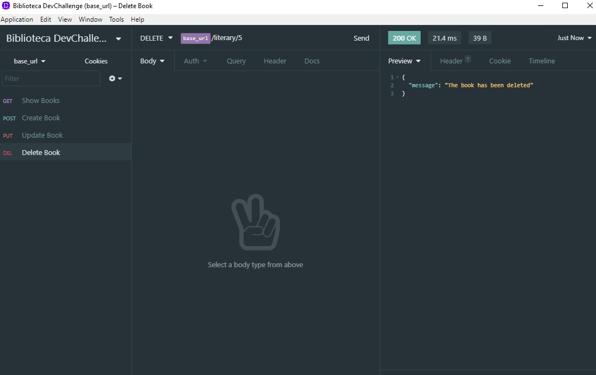

# biblioteca-devChallenge :rocket:

Repositório responsável por armazenar o resultado do desafio back-end do Dev Challenge.
O desafio encontra-se disponível nesse <a href="https://github.com/devchallenge-io/biblioteca-backend">link</a>.

## Dev Challenge :computer:

O Dev Challenge é um site onde é listado uma série de desafios para serem reproduzidos.

## Desafio

O desafio consistia em reproduzir o back-end de um biblioteca, contemplando as 4 operações básicas de um CRUD, criar registro, ler registro, atualizar registro e deletar registro.

Além do desafio básico, decidi dar um passo além utilizando banco de dados e um query builder para facilitar a criação das queries SQL.

### GET (Buscar)

### POST (Criar)

### PUT (Atualizar)

### DELETE (Deletar)

## Tecnologias utilizadas :book:

- Typescript
- NodeJS
- Knex
- Sqlite3

## Como rodar :fire:

1. Clone este repositório
1. Rode `npm install` para instalar todas as dependências do projeto.
1. Rode a aplicação com a sua ferramenta de teste de rotas favoritas no endereço `http://localhost:3333`.

###### Com amor :heart: Samuel
